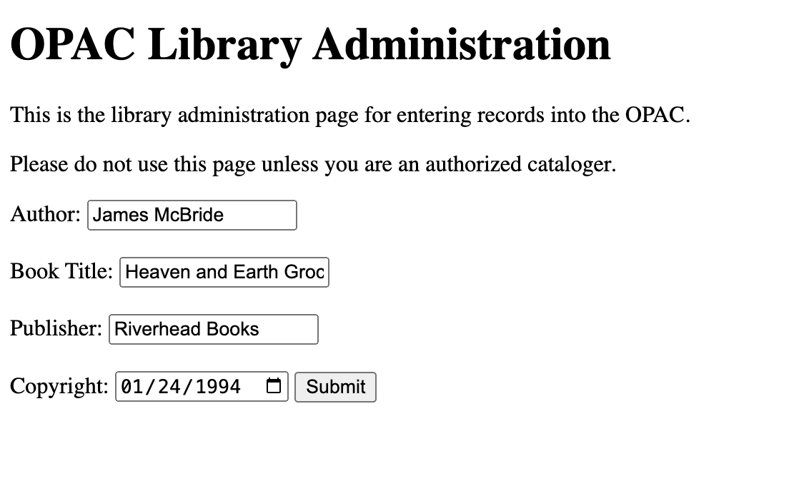
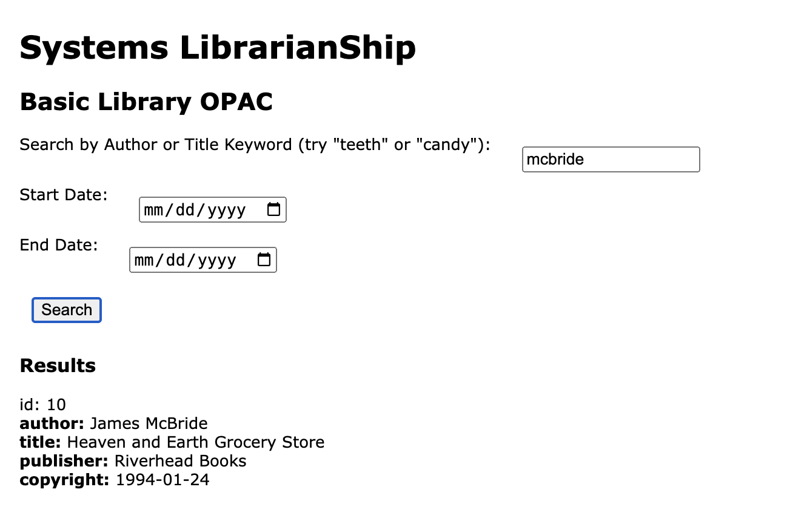

# OPAC

Interesting to work with MySQL at the command line level... which I rarely do (MySQL Workbench, usually), but this entire process has re-invigorated my delight with the command line environment. The flexibility of it makes me want to further explore shell-scripting... Bash shell.

I particularly appreciated the lesson on htpasswd and htaccess. Apache, even after a number of years, is always somewhat confusing... daunting.

BTW, I have bookmarked <a href="https://cseanburns.github.io/systems-librarianship/">https://cseanburns.github.io/systems-librarianship/</a>. It's nice to have such a full account of Unix/CLI/LAMP set up. Online resources and tutorials often tend to focus more specifically on tasks/issues/troubleshooting, but I prefer (and miss) the more bookish approach... single voice over multiple topics creates clarity.

OPAC Cataloging 

OPAC Retrieval 

